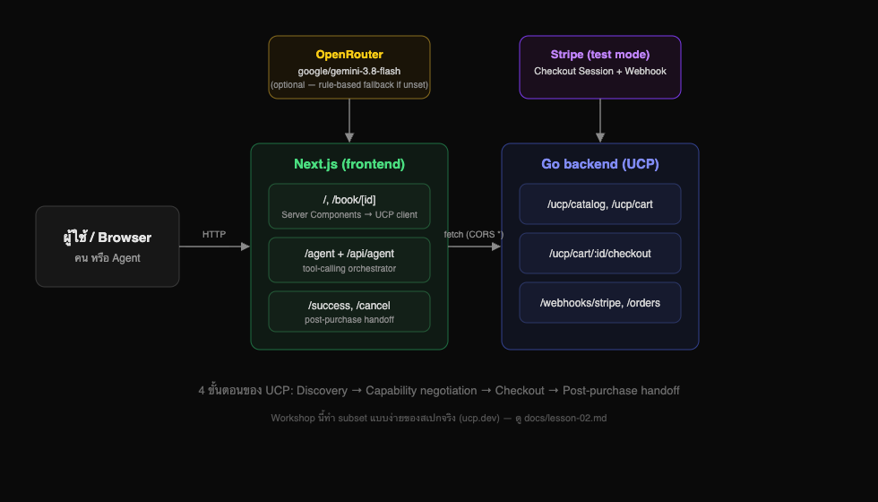
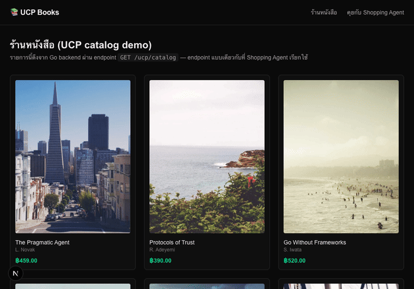
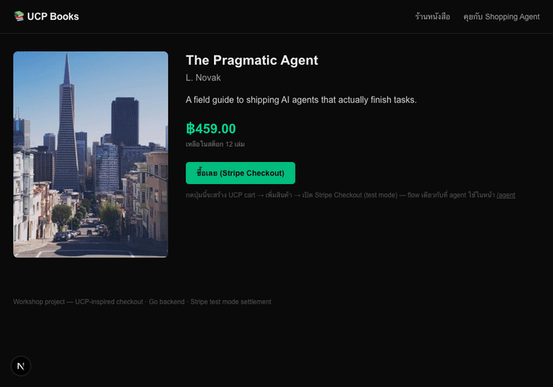
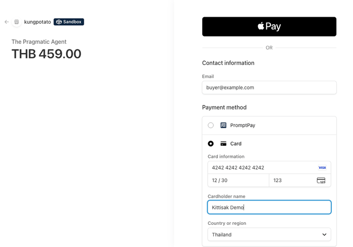
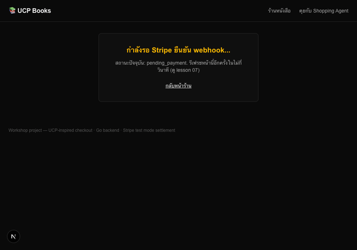
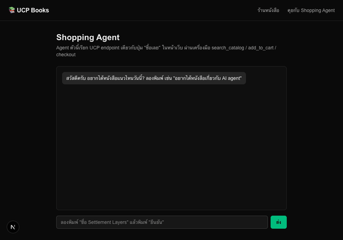
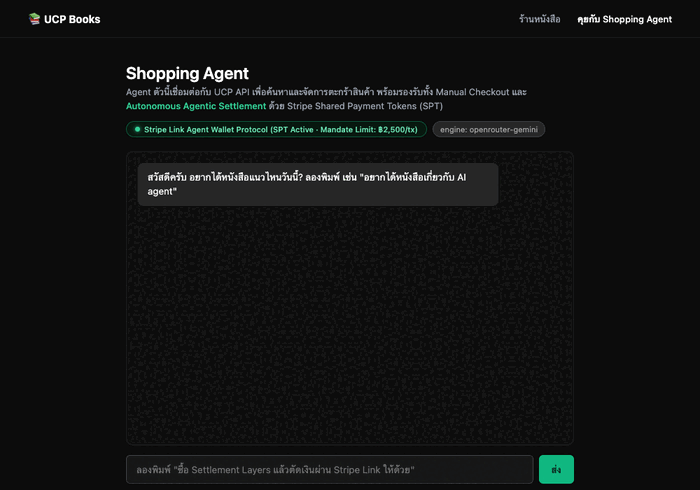

# UCP Books — Agentic Payment Workshop

ร้านหนังสือออนไลน์ตัวอย่างที่สอนการทำ **agentic commerce**: มนุษย์กับ AI agent ซื้อของผ่าน endpoint ชุดเดียวกันที่ implement ตามแนวคิดของ [UCP (Universal Commerce Protocol)](https://ucp.dev) การชำระเงิน settle จริงที่ **Stripe (test mode)**



## Stack

| ส่วน | เทคโนโลยี | หน้าที่ |
|---|---|---|
| Backend | Go (stdlib ล้วน, zero dependency) | UCP catalog/cart/checkout + Stripe settlement (Checkout & SPT) + webhook |
| Frontend | Next.js (App Router) | ร้านค้าแบบคลิกปกติ + AI shopping agent (chat) |
| Payment | Stripe Checkout + Shared Payment Tokens (SPT) + Link Wallet | settlement จริง (ทั้ง manual redirect และ autonomous agentic payment) |
| AI | OpenRouter → `google/gemini-3.8-flash` (มี fallback แบบ rule-based ถ้าไม่ตั้งค่า key) | เข้าใจภาษาธรรมชาติแล้วเรียก UCP tool |

## บทเรียน (อ่านตามลำดับ)

| # | เรื่อง | Demo |
|---|---|---|
| 01 | [Setup & Architecture](docs/lesson-01.md) |  |
| 02 | [UCP Catalog & Cart](docs/lesson-02.md) |  |
| 03 | [Manual Checkout → Stripe Session](docs/lesson-03.md) |  |
| 04 | [Settlement: จ่ายเงินจริงบน Stripe](docs/lesson-04.md) |  |
| 05 | [Webhook & Order Confirmation](docs/lesson-05.md) |  |
| 06 | [AI Shopping Agent (OpenRouter Gemini)](docs/lesson-06.md) |  |
| 07 | [Human UI vs Agent UI](docs/lesson-07.md) |  |
| 08 | [End-to-End Recap](docs/lesson-08.md) |  |
| 09 | [Autonomous Settlement (Stripe SPT & Link)](docs/lesson-09.md) |  |

แต่ละบทมี **goal, สิ่งที่ทำ, ทำไมถึงออกแบบแบบนี้ (พร้อมเทียบกับทางเลือกอื่น), และต่อยอดได้อะไร** — ไม่ใช่แค่ "ทำตามนี้"

## รันเอง (local)

### 1. Backend

```bash
cd backend
go run .
```

รันที่ `:8080` อ่าน `../.env` (หรือ `backend/.env`) อัตโนมัติ ต้องมี `STRIPE_SECRET_KEY` (ดู `.env.example`)

### 2. Stripe webhook forwarding (แยก terminal)

```bash
stripe listen --forward-to localhost:8080/webhooks/stripe
```

คัดลอกค่า `whsec_...` ที่ได้ไปใส่ `STRIPE_WEBHOOK_SECRET` ใน `.env`

### 3. Frontend

```bash
cd frontend
npm install
cp .env.local.example .env.local   # แก้ค่าตามต้องการ
npm run dev
```

เปิด `http://localhost:3000`

### 4. (ไม่บังคับ) AI Agent จริงแทน rule-based fallback

ใส่ `OPENROUTER_API_KEY` ใน `frontend/.env.local` — ไม่ใส่ก็ใช้งานได้ปกติ แค่ `/agent` จะสลับไปใช้ parser แบบ rule-based แทน (ดู [lesson 06](docs/lesson-06.md))

## สร้าง gif/image เอง (reproducible docs)

รูปและ gif ทุกอันใน `docs/media/` capture มาจากแอปที่รันจริง ไม่ใช่ mockup:

```bash
# รัน backend + frontend ให้พร้อมก่อน (ports 8080, 3000)
cd docs/scripts
npm install
node capture.mjs
```

ดูรายละเอียดที่ [lesson 08](docs/lesson-08.md)

## โครงสร้างโปรเจกต์

```
backend/    Go UCP + Stripe settlement server
frontend/   Next.js — ร้านค้า + AI agent
docs/       บทเรียนภาษาไทย + media + capture script
```
