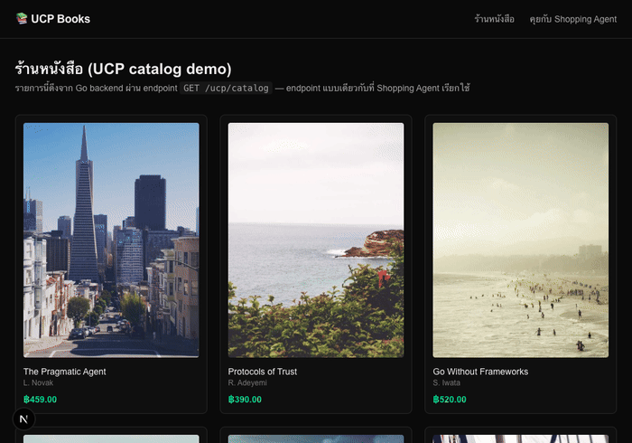

# Lesson 07 — Human UI vs Agent UI: สอง client บน UCP เดียวกัน

## Goal
เปรียบเทียบ UX สองแบบข้าง ๆ กันให้เห็นชัดว่า "agentic commerce" ไม่ได้มาแทนที่ UI ปกติ แต่เป็น **ทางเลือกเพิ่ม** บน data contract เดียวกัน

## สิ่งที่ทำ
- `/` และ `/book/[id]` — มนุษย์เลือกเอง คลิกเอง เห็นราคา/รูปภาพ/สต็อกครบ เหมาะกับตอนที่ผู้ใช้อยากเปรียบเทียบตัวเลือกเอง
- `/agent` — พิมพ์คุยเป็นภาษาธรรมชาติ เหมาะกับตอนที่ผู้ใช้รู้ว่าอยากได้อะไรอยู่แล้วแค่ไม่อยากไล่คลิกเอง (เช่น "อยากได้หนังสือเกี่ยวกับ AI agent สักเล่ม")

ทั้งสองเส้นทางจบที่ Stripe Checkout Session เดียวกัน (lesson 03) และ order model เดียวกัน (lesson 05) — ไม่มี "เส้นทางพิเศษสำหรับ agent" แยกออกไปเลย

## ทำไมไม่ทำ UI แบบเดียวแล้วฝัง chat widget ทับ
ทางเลือกที่ดูง่ายกว่าคือฝัง chat widget ไว้มุมจอ แต่ถ้าฝังทับ UI เดิมจะสื่อผิดว่า agent เป็นแค่ "ฟีเจอร์ช่วยเหลือ" ทั้งที่จริง ๆ มันคือ **client ที่สมบูรณ์แบบหนึ่ง** ที่ควรออกแบบ system prompt, guardrail (ต้องถามยืนยันก่อนจ่ายเงิน — lesson 06), และ error handling ของตัวเองอย่างจริงจัง การแยกหน้า `/agent` ชัด ๆ บังคับให้เราคิดเรื่องนี้ตั้งแต่แรก

## เทียบกับแบบอื่น
| แบบ | เหมาะกับ |
|---|---|
| Manual UI อย่างเดียว | ผู้ใช้อยากเบราว์ส เปรียบเทียบ ตัดสินใจเอง |
| Agent อย่างเดียว | ระบบที่ผู้ใช้บอกเป้าหมายแล้วปล่อยให้ระบบจัดการ (เช่น "เติมของใช้ประจำเดือนให้หน่อย") |
| **ทั้งคู่บน UCP เดียวกัน (ที่เลือกใช้)** | รองรับทั้งสองพฤติกรรมโดยรักษาความถูกต้องของธุรกรรมไว้ที่จุดเดียว (Go backend) |

## ต่อยอดได้อะไร
- เพิ่มปุ่ม "ให้ agent หาให้" อยู่ในหน้า manual UI เพื่อสลับโหมดได้แบบไม่ต้องเปลี่ยนหน้า
- วัด conversion/experience เทียบกันระหว่างสอง flow เพื่อตัดสินใจว่าจะลงทุนพัฒนาฝั่งไหนต่อ
